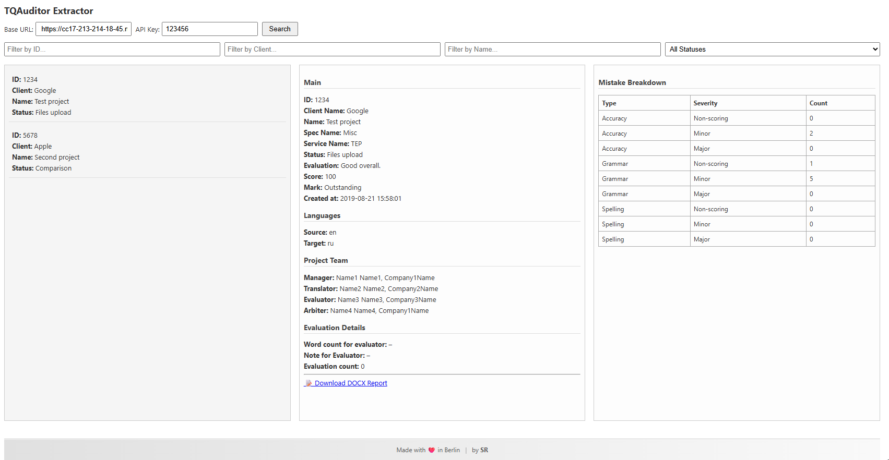

# 🌐 TQAuditor Extractor for Web

This is the **web-based version** of the TQAuditor Extractor:  
A clean and simple Flask app that lets you search, view, and download evaluation reports from a mock TQAuditor API.

🎯 Hosted-ready (e.g. [PythonAnywhere](https://www.pythonanywhere.com/))  
🧑‍💼 Designed for non-technical users  
📥 Outputs clean `.docx` reports  
🔐 No login required — just enter your API key and base URL

---

## ✅ Features

- 🔍 Search/filter projects by ID, client name, project name, or status
- 📄 View detailed project metadata and evaluation metrics
- 📝 Download formatted Word reports with mistake tables
- 🧠 Client-side filters (fast and private)
- ⚙️ Easily deployable to PythonAnywhere or your own server

---

## 🧪 Screenshot



---

## 🚀 Getting Started (Local)

### 1. Clone the repo

```bash
git clone https://github.com/SufiSR/TQAuditorExtractor-for-Web.git
cd TQAuditorExtractor-for-Web
````

### 2. Install requirements

```bash
pip install -r requirements.txt
```

### 3. Run the Flask app

```bash
python app.py
```

Then open:
👉 `http://localhost:5000`

---

## ☁️ Deploying on PythonAnywhere

1. Upload the repo via Git or ZIP

2. Create a **Manual Web App** (Python 3.10+)

3. Edit the WSGI config:

   ```python
   import sys
   import os

   path = '/home/yourusername/TQAuditorExtractor-for-Web'
   if path not in sys.path:
       sys.path.insert(0, path)

   from app import app as application
   ```

4. In the Bash console:

   ```bash
   pip3.10 install --user -r requirements.txt
   ```

5. Click **Reload** in the Web tab.

Your app is now live at:
🔗 `https://yourusername.pythonanywhere.com`

---

## 📎 Download Notes

* Chrome may warn you that `.docx` files are uncommon — you can safely keep the file.
* All `.docx` reports are generated dynamically from project data and include:

  * Main metadata
  * Language info
  * Project team
  * Evaluation summary
  * Mistake breakdown table

---

## 🧩 File Structure

```
├── app.py                  # Flask app with API integration
├── requirements.txt        # Dependencies
├── templates/
│   └── index.html          # Main HTML page
├── static/
│   └── styles.css          # App styling
```

---

## 🔐 API Notes

You need:

* ✅ An API key (entered manually)
* ✅ The base URL of your TQAuditor-compatible API (e.g. mock server)

No data is stored or logged — everything is fetched client-side and rendered in real time.

---

## ❤️ Built with Love in Berlin by SR

For internal use, testing, and non-technical team members who need quick access to evaluation insights.

---

## 📃 License

MIT License — Free to use, modify, and distribute. Attribution appreciated.
